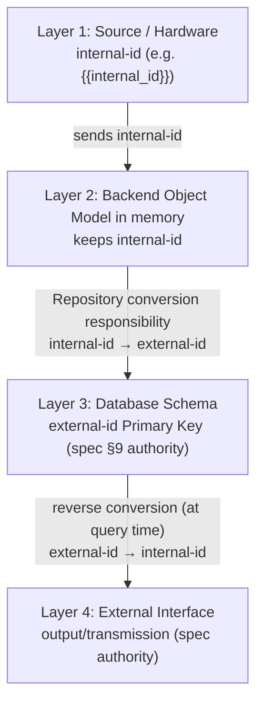

<!-- ROLE BANNER ───────────────────────────────────────────────────────────
  Phase: S3 Planning / Gate P-2 (output-sink contract freeze).
  What this document decides: the full relationships of the DB tables (PK/FK/ON DELETE)
    + per-domain ERD + the Object-Identifier ↔ Primary-Key Mapper doctrine
    (internal-ID vs external-ID, ts unit policy).
  What this document does NOT decide: per-column formulas/ranges (= data_spec template) ·
    declaration of identifier/unit anchor constants (= identifier_unit_contract template).
  How to fill: replace each {{PLACEHOLDER}} + fill the Mermaid blocks with real tables and
    freeze at v{{X}}. If the output sink is undecided on day 1, at minimum fix the
    StorageService Facade signature.
─────────────────────────────────────────────────────────────────────────── -->

# {{PROJECT_NAME}} DB Single-Authority ERD ({{N_TABLES}} tables)

> **This document is the single authoritative ERD (Entity-Relationship Diagram) for the {{PROJECT_NAME}} DB schema.**
> For future schema corrections, use this ERD and [`_TEMPLATE_data_spec.md`](./_TEMPLATE_data_spec.md) §9 as the authority.
> Other scattered ERDs (research.md / *_conceptual.md / *_design.md) are simplified to references to this file.

---

## Metadata

| Item | Value |
|:---|:---|
| Document ID | `{{ERD_DOC_ID}}` |
| Current version | **{{VERSION}}** |
| Created | {{YYYY-MM-DD}} |
| Authority level | **Authoritative — takes precedence over other ERDs** |
| Target DB | {{DB_ENGINE}} (`{{DB_PATH}}`) |
| Table count | {{N_TABLES}} ({{DOMAIN_BREAKDOWN}}) |
| Authority alignment | [`_TEMPLATE_data_spec.md`](./_TEMPLATE_data_spec.md) §9 |

---

## Changelog

| Version | Date | Change | Decided by |
|:---:|:---:|:---|:---|
| **{{VERSION}}** | {{YYYY-MM-DD}} | <!-- First consolidated ERD. Table count + the kinds of per-domain ERDs. --> | {{DECIDER}} |

---

## Preview Note

To preview the Mermaid diagrams in this document, install a Markdown Mermaid renderer (e.g. VSCode "Markdown Preview Mermaid Support") and open the preview.

---

## 1. Full {{N_TABLES}}-table ERD (relationship-centric)

> See every table's PK / FK / relationships at a glance. For column enumeration, see the per-domain ERDs in §2 onward.

```mermaid
erDiagram
    %% Domain A
    {{PARENT}} ||--|{ {{CHILD}} : "1:N ({{ON_DELETE}})"

    %% Independent table (no FK)
    %% {{INDEPENDENT_TABLE}} : "independent catalog"

    {{PARENT}} {
        {{PK_TYPE}} {{pk}} PK "{{NOTE}}"
        {{COL_TYPE}} {{col}}
    }
    {{CHILD}} {
        {{PK_TYPE}} {{pk}} PK
        {{FK_TYPE}} {{parent}}_id FK
        {{COL_TYPE}} {{col}}
    }
```

---

## 2. {{PRIMARY_DOMAIN}} Domain ERD (most important — aligned with spec §9)

> Full column enumeration of the core tables. This ERD is the core of the data flow.

```mermaid
erDiagram
    {{PARENT}} ||--|{ {{CHILD}} : "1:N ({{ON_DELETE}})"

    {{CHILD}} {
        {{PK_TYPE}} {{ts}} PK "{{TS_UNIT_NOTE}}"
        {{COL_TYPE}} {{external_id}} PK "spec §9.2"
        {{FK_TYPE}} {{parent}}_id FK "{{ON_DELETE}}"
        {{COL_TYPE}} {{data_col}} "{{RANGE}}"
    }
```

### 2.1 Relationship between the independent catalog and the measurement table — semantic mapping (not a FK, if applicable)

> A pattern where the operational catalog (current values only) and the per-instant measurement table (each instant persisted as-is) are **not enforced by a Foreign Key**.
> The two values may be the same or different (they change during operation) → not enforcing a FK guarantees per-instant accuracy.

```
{{CATALOG_TABLE}} (operational catalog, current values only)
        │ mapped by {{MAPPER}}
        ▼
{{MEASUREMENT_TABLE}} (per-instant value, persisted as-is)
```

### 2.2 Object Identifier ↔ Database Primary Key conversion flow (layered authority separation)

> **Authority-separation policy**: each layer of the system uses its own authoritative identifier. The Mapper Pattern makes the
> per-layer conversion responsibility explicit in the Repository. For detailed anchors, see [`_TEMPLATE_identifier_unit_contract.md`](./_TEMPLATE_identifier_unit_contract.md).



#### Per-layer authority alignment

| Layer | Identifier | Authority source |
|:---|:---|:---|
| 1. Source / Hardware | {{internal_id}} (internal-id) | {{SOURCE_AUTHORITY}} |
| 2. Backend Object Model | {{internal_id}} (Object Identifier) | natural flow from Source |
| 3. Database Schema | {{external_id}} (Primary Key) | spec §9 |
| 4. External Interface | {{external_id}} (output column) | spec §3.1 header |

#### The Repository's conversion responsibility (Mapper Pattern)

```
Store flow (internal-id → external-id):
   Repository.insert(obj)
     1. {{MAP_TABLE}}[obj.{{internal_id}}] → convert to {{external_id}}
     2. INSERT INTO {{MEASUREMENT_TABLE}} (..., {{external_id}}, ...)

Query flow (external-id → internal-id reverse conversion):
   Repository.query()
     1. SELECT * → rows
     2. row.{{external_id}} → index → {{internal_id}}
     3. build Object(internal_id=..., ...)
```

#### Why this separation is not a stopgap

| Review item | Assessment |
|:---|:---|
| Keep deprecated + run new structure in parallel? | ❌ — both identifiers are legitimate authorities (Source vs Spec) |
| Work around a wrong assumption? | ❌ — respects the natural flow of each layer |
| Two systems coexisting? | ❌ — responsibility is explicitly separated by the Mapper Pattern |
| Accumulating future correction cost? | ❌ — only a single conversion point in the Repository to manage |

→ **A textbook design of the Mapper Pattern.**

---

## 3. {{SECONDARY_DOMAIN}} Domain ERD

```mermaid
erDiagram
    {{PARENT}} ||--o{ {{CHILD}} : "{{RELATION_NOTE}}"

    {{CHILD}} {
        {{PK_TYPE}} {{pk}} PK
        {{COL_TYPE}} {{col}}
    }
```

---

## 4. PK / FK Policy Summary

| Relationship | ON DELETE | ON UPDATE | Meaning |
|:---|:---:|:---:|:---|
| {{child}}.{{parent}}_id → {{parent}}.id | {{ON_DELETE}} | {{ON_UPDATE}} | {{RATIONALE}} |

**FK retired (if applicable)**:
- ~~{{deprecated_fk}}~~ — retired ({{DATE}}, aligned with spec §9 authority)

---

## 5. Index Policy Summary

| Index | Table | Columns | Type | Purpose |
|:---|:---|:---|:---:|:---|
| idx_{{table}}_{{col}} | {{table}} | {{col}} | B-tree | {{PURPOSE}} |

---

## 6. Timestamp Unit Policy (ts-unit policy)

> The unit of the ts column may differ per table, so **document it here** (the anchor constants are
> owned by [`_TEMPLATE_identifier_unit_contract.md`](./_TEMPLATE_identifier_unit_contract.md)).

| Table | ts column | Unit | Note |
|:---|:---|:---|:---|
| {{table_high_res}} | {{ts}} | {{epoch_ms_or_s}} | {{NOTE}} |

> The internal timing control (elapsed/evict decisions) uses a **monotonic** clock; the ts stored in the DB is **epoch** — the separation principle.

---

## 7. Related Authoritative Materials

| Area | Authoritative document |
|:---|:---|
| Data definition | [`_TEMPLATE_data_spec.md`](./_TEMPLATE_data_spec.md) §3.1, §9 |
| Identifier/unit contract | [`_TEMPLATE_identifier_unit_contract.md`](./_TEMPLATE_identifier_unit_contract.md) |

---

**End of document.**
